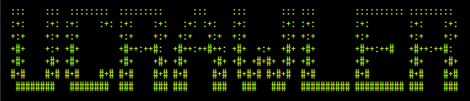

# UTFcrawler
This is a project that is designed to create an RPG game using Unicode characters as ASCII art, instead of using raw ASCII.   

[&style=flat-square)]() 
 
 
| `master :: `

### TODO List:
- main.rs:
    - [ ] initialize the game itself.
    
- combat.rs:
    - [ ] implement the battle flow for the game. (started)
    - [ ] implement the random generator for the encounter rate of enemies.
    - [ ] implement damage calculations.
    - [ ] implement damage resistances and weaknesses.
    - [ ] implement combat turn orders (started)
    - [ ] implement hit rate and evasion calculations
    - [ ] implement stat displays (UI)
    - [ ] implement all various types of skills
    - [ ] possible implementation of difficulty (optional)
    
- dungeon.rs
    - [ ] implement the layout(s) and generation of the dungeon (started)
    - [ ] implement the traversal of the dungeon
    - [ ] set up saving areas (optional)
    - [ ] implement possible mini-map display (UI)
    
- enemy.rs
    - [x] create Enemy structs that can be used
    - [ ] implement common enemies
    - [ ] implement bosses
    - [ ] implement all enemy weaknesses and/or resistances (optional(?))
    
- player.rs [95% complete]
    - [x] implement fields for a player character to exist and be controlled (mostly complete)
    - [x] implement a function that handles experience points
    - [x] implement functions that deals with level ups
    - [x] declare archetypes for the player (think classes in a traditional RPG)
    
- status.rs
    - [x] declare enums and values for status ailments and potential psyche ailments (more might be added later.)
    
- inventory.rs
    - [ ] create and implement inventory functions (started)
    
- game_state.rs
    - [x] created palettes for coloring the display
    - [x] created enums for holding the data needed to make a choice of which palette to use
    - [ ] created function(s) for determining if terminal window window will be able to display RGB colors
    - [ ] added score struct
    - [ ] implemented score saving and a leader board of sorts
    
- util.rs (optional)
    - [ ] implement saving functionality
    - [ ] implement loading functionality

#### For the team members: 
Recommended reading: [The Rust Programming Language](https://doc.rust-lang.org/stable/book/2018-edition/)  
Recommended IDE: [IntelliJ Community Edition](https://www.jetbrains.com/idea/download/#section=windows)  
Recommended Plugin (for Rust support): [IntelliJ Rust](https://intellij-rust.github.io/)  
